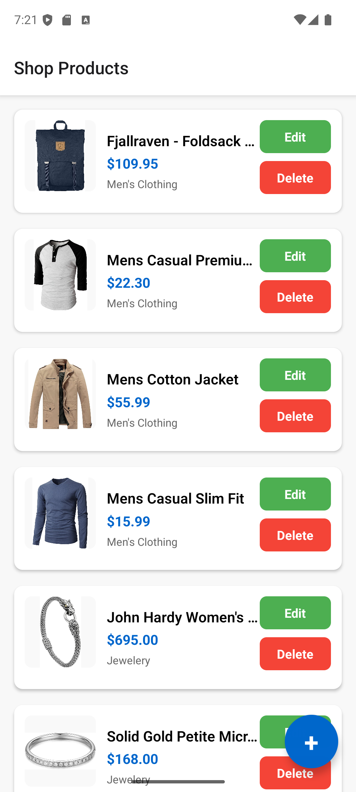
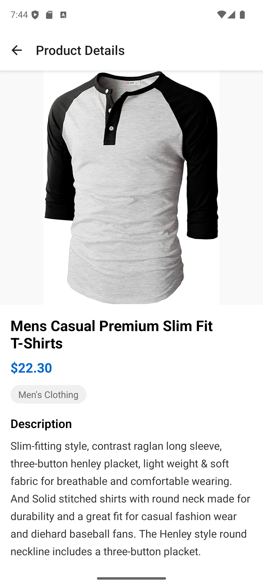
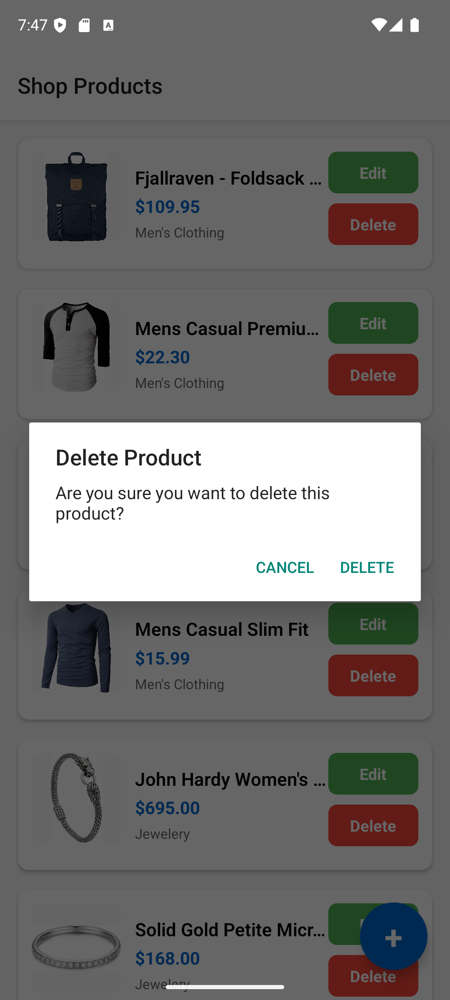
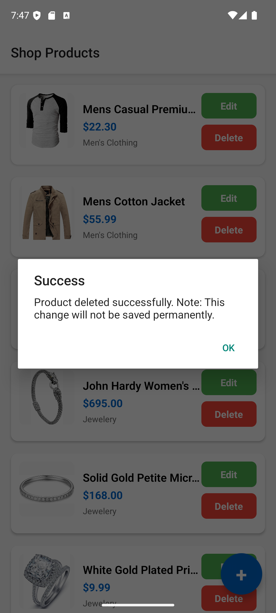
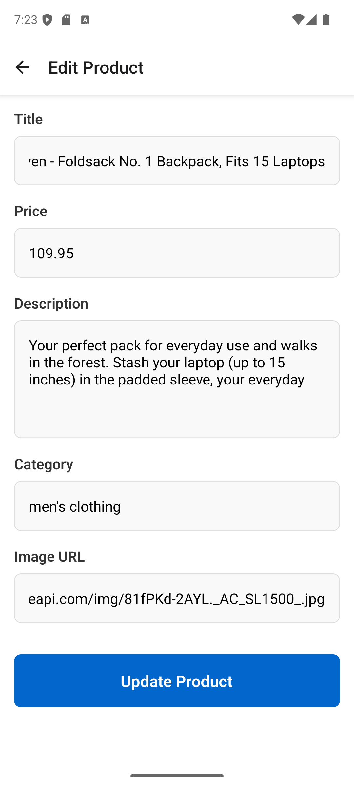
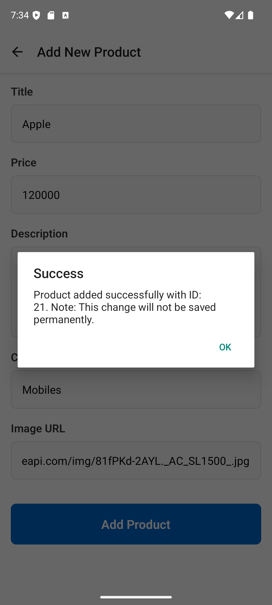
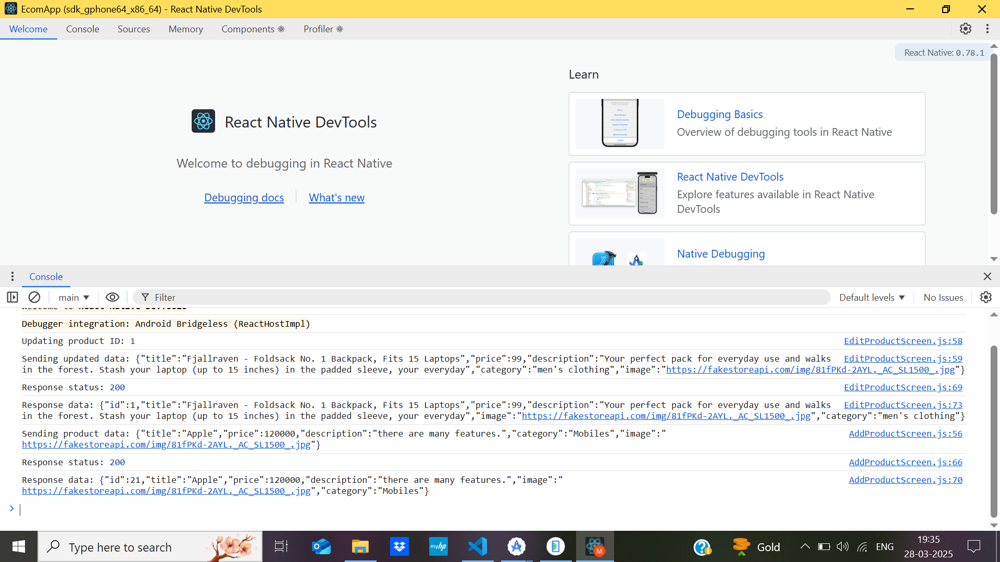

# EcommerceReact Native E-commerce App
A simple e-commerce mobile application built with React Native that integrates with the Fake Store API. This app demonstrates how to create a functional e-commerce experience with product listing, details, and management features.

Features:
=> View detailed product information
=> Add new products
=> Edit existing products
=> Delete products
=> Real-time API integration
=> This project uses the Fake Store API for all product operations:

Prerequisites:
=> Node.js 
=> Android Studio 
=> Android Emulator or Physical Device

Setup Instructions:
Clone the repository
git clone https://github.com/monicamreddy/Ecommerce.git
cd Ecommerce

Dependencies:
These are the libraries required to run the application.
1) @react-navigation/native: npm install @react-navigation/native
2) @react-navigation/stack: npm install @react-navigation/stack
3) react-native-gesture-handler: npm install react-native-gesture-handler
4) react-native-reanimated: npm install react-native-reanimated
5) react-native-safe-area-context: npm install react-native-safe-area-context
6) react-native-screens: npm install react-native-screens
7) react-native-vector-icons: npm install react-native-vector-icons
8) To install all the dependencies (both dependencies and devDependencies): npm install

Steps to run:
1) npx react-native start
2) npx raect-native run-android

Note:
The Fake Store API is a demo/mock API that simulates responses but doesn't actually persist changes to its database. When you:

1. Make a PUT request to update a product - it returns a success response with the updated data
2. Make a POST request to add a product - it returns a success response with the new product and ID
3. But when you fetch the products list again, you get the original dataset, not including your changes.

This is by design - the API documentation states: "Note: post, put and delete calls don't really update the store."

Screenshots:
Here are some screenshots of the app with descriptions:

    
    
<strong>All product list where users can view, edit, delete, and add their product details.
    </strong>

    
    
<strong>Detailed information of the product.</strong>

    
    
<strong>Detailed information of the product.</strong>

    
    
<strong>Deleting the product.</strong>

    
    
<strong>Deleting the product is successful.</strong>

    
    
<strong>After Deleting the product, the product list.</strong>

    
    
<strong>Updating the product.</strong>

    
    
<strong>Updating the product is successful.</strong>

    
    
<strong>Console for edit product.</strong>

    
    
<strong>Adding new product.</strong>

    
    
<strong>Entering the details for adding new product.</strong>

    
    
<strong>Adding new product successfull.</strong>

    
    
<strong>Console for adding new product.</strong>

